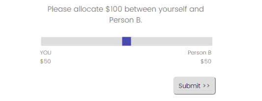

This script creates a dynamic slider interface for a two-player allocation game (dictator game). It also saves the decision-maker's payment and the transfer as embedded data. You can customize the parameters (e.g., total amount, default amount, player names, etc.) in the JS.

<h2> HOW TO INSTALL</h2>

1. Copy the CSS into Look & Feel > Style > Custom CSS.
2. Copy the JS in any Qualtrics question.
3. Create the following embedded data in the Survey Flow, before executing this script:
- taskPayment = [leave it blank]
- transfer = [leave it blank]

Try the DEMO here: https://cmu.ca1.qualtrics.com/jfe/form/SV_80QtgSC1Rdplbvf
