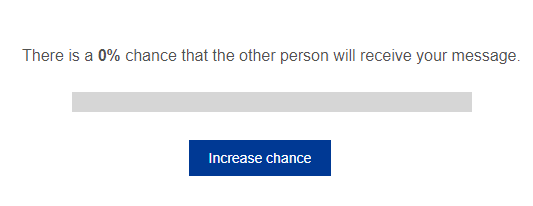

This script creates a progress bar that can be filled by clicking on a button. You can customize the 'click cost function', i.e. make it more or less difficult to fill the bar. The progress (%), as well as the click count is saved as a Qualtrics embedded variable.

<h2>HOW TO INSTALL</h2>

1. Copy the HTML code into the question text of a Qualtrics question.
2. Add the JS to the same question.
3. Copy the CSS into Look & Feel > Style > CSS editor.
4. Define the following embedded data in the Survey Flow before you execute this script:
- probability = [leave blank]
- clickCount = [leave blank]
- multiplier = 1 [or use any integer]
- exponent = 0.87 [or some exponent between 0 and 1]
